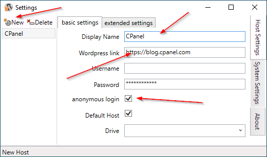
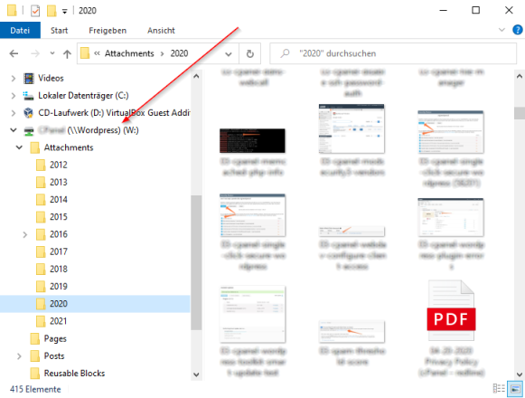

# WordpressDrive

## About

WordpressDrive is a Windows Userspace Filesystem, that lets you access any Wordpress Site, that supports the Wordpress REST API (default) as a Windows Drive (Share).

Posts and Pages are organized in Folders as HTML Files. Media File types are represented by their file type depending from extension.

The Application starts as a taskbar icon, all user interaction can be started from there. Working with Wordpress data happens with the standard Windows tools (Explorer, CMD, ...).

Based on **WinFSP by Bill Zissimopoulos** [https://github.com/billziss-gh/winfsp](https://github.com/billziss-gh/winfsp) 

## Usage
You can start WordpressDrive from the Startmenu (or put it into autostart).  

  

On first startup (empty hostlist) the settings window is opened automatically, and new Wordpress host(s) can be registered.

  

Minimum host information is the Wordpress host url. If you don't want to login to the Wordpress site check "anonymous login". For you convinience give it a display name.
Closing the settings window (x cross at the top) will save this entry(s).

If you want to connect to your registered host you will find the WordpressDrive Icon in the Taskbar.  

   
  
You open the popup Menu by using the right mouse button on the icon. Now you can select a host to connect to it (you will get a message if connection was successful).

If you want to work with the connected Wordpress host open e.g. the windows file explorer und you will find the drive connected:  
  
   
  

## Installation
Download the latest Release from [here](https://github.com/printpagestopdf/WordpressDrive/releases/latest).

Choose the appropriate one from the artifacts:  

**WordpressDriveSetup.exe:**  
Installer of WordpressDrive including WinFsp (best to use if not already installed WinFsp)

**WordpressDriveSetup.msi:**  
Installer of WordpressDrive (needs WinFsp installed)

**WordpressDriveFiles.zip:**  
Application Files without installer

Files ending with _x64 are usable for 64 bit Platforms only.
Files without the trailing _x64 can be used on 32 and 64 bit Plattforms.

